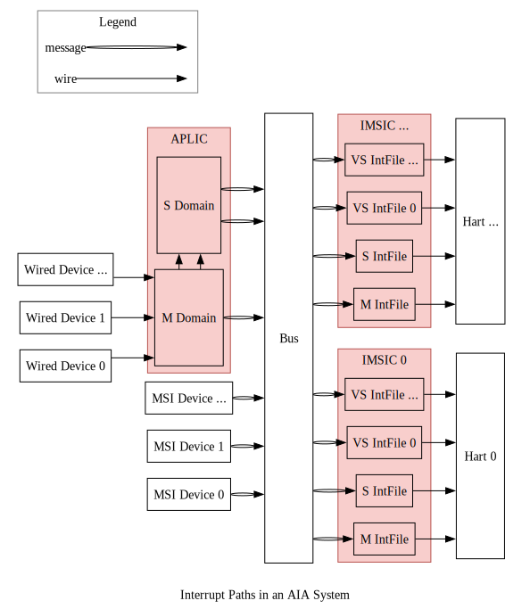

# OpenAIA.scala Overview

<!-- vim-markdown-toc GFM -->

* [Introduction](#introduction)
* [Interrupt Paths](#interrupt-paths)
* [Configuration Paths](#configuration-paths)
* [References](#references)

<!-- vim-markdown-toc -->

The implementation of OpenAIA.scala adheres to the [RISC-V Advanced Interrupt Architecture (AIA) Specification](https://github.com/riscv/riscv-aia).
Any discrepancies between the implementation and specification should be treated as implementation bugs.

## Introduction

AIA is designed to efficiently route external interrupts to the appropriate harts and privilege levels.
This routing is accomplished by two interrupt controllers:

* Incoming Message-Signaled Interrupt Controller (**IMSIC**)
* Advanced Platform-Level Interrupt Controller (**APLIC**)

Why two types of controllers?
There are two types of external devices:

1. **Wired devices**:
  Interrupts are transmitted via dedicated electronic signals (edge or level),
  which is simple to implement but faces scalability challenges,
  as each interrupt requires an physical wire connected to the hart.
2. **Message-signaled-interrupt (MSI) devices**:
  Interrupts are encoded as messages and transmitted over bus/network,
  which offers better scalability compared to wired interrupts,
  as no dedicated physical wires needed for each interrupt.

In RISC-V AIA:

* **APLIC** handles wired external interrupts.
  **Note**: APLIC can operate in two modes (`domaincfg.DM`):
  * **Direct delivery mode**: APLIC directly routes wired interrupts to harts without IMSIC involvement.
  * **MSI delivery mode**: APLIC converts wired interrupts into MSIs and forwards them to IMSIC.
  * Since MSIs represent the more scalable approach, our subsequent discussion will focus on APLIC's MSI delivery mode.
* **IMSIC** handles message-signaled external interrupts.

The interaction between devices, interrupt controllers, and harts involves two main types of data paths:
**interrupt paths** and **configuration paths**, shown as the following two figures.

## Interrupt Paths

External interrupts primarily originate from external devices,
though in advanced scenarios, internal devices and harts can also generate "external" interrupts
(e.g. when supervisor level injects external interrupts into virtualized supervisor level).
The following discussion focuses on the typical case where external devices generate interrupts that are routed through controllers to harts.

Here are the detailed interrupts paths (note: "external" is omitted where context is clear):

* Interrupts originate from either wired devices or MSI devices:
  * Wired device paths:
    * Interrupts are directed to APLIC's **interrupt domains**.
    * Each domain manages interrupts for a specific set of harts at a given privilege level.
    * For large symmetric multiprocessing systems, typically two domains suffice [^two_interrupt_domains]:
      * One **machine-level domain**,
      * One **supervisor-level domain**.
    * Domains follow a hierarchical structure:
      * All wired interrupts fist arrive at the machine-level domain.
      * Based on APLIC configuration, each interrup is either:
        * Converted to MSI and forwarded to IMSIC via bus/network,
        * Delegated to child domains, which then follow similar processing.
  * MSI device paths:
    * MSIs route directly to IMSIC via bus/network.
* IMSIC processing:
  * Each hart typically has its dedicated IMSIC.
  * Each IMSIC contains multiple **interrupt files**, one per privilege level [^one_imsic_per_hart]:
    * One **machine level**,
    * One **supervisor level**,
    * Multiple **virtualized supervisor levels**.
  * Each interrupt file:
    * Maintains interrup status (pending, enabled, ...),
    * Signals hart based on configuration via wire connection.

## Configuration Paths

Configuration flow follows two distinct paths:

* IMSIC configuration:
  * Each hart configures only its dedicated IMSIC,
  * Configuration occurs through direct wire connection.
* APLIC Configuration:
  * All harts can configure APLIC,
  * Configuration transmitted via bus as messages.

## References

* [^two_interrupt_domains]: *The RISC-V Advanced Interrupt Architecture*: 4.2 Interrupt domains: Figure 4.
* [^one_imsic_per_hart]: *The RISC-V Advanced Interrupt Architecture*: 1.3.2. External interrupts with IMSICs.
