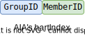

# 🧭集成指南（Integration Guide）

<!-- vim-markdown-toc GFM -->

* [概览（Overview）](#概览overview)
* [参数（Parameters）](#参数parameters)
* [实例化（Instantiation）](#实例化instantiation)
  * [<span style="color:red;">关于hartIndex（About hartIndex）</span>](#span-stylecolorred关于hartindexabout-hartindexspan)
* [示例（Examples）](#示例examples)
  * [简单的4核系统（A Simple 4-Hart System）](#简单的4核系统a-simple-4-hart-system)
  * [分组的4核系统（A Grouped 4-Hart System）](#分组的4核系统a-grouped-4-hart-system)

<!-- vim-markdown-toc -->

本指南介绍如何将ChiselAIA集成到RISC-V系统中。

This guide introduces the integration process of ChiselAIA into a RISC-V system.


## 概览（Overview）

集成涉及3个Scala文件和4个Scala类：

* `TLAPLIC`（@`APLIC.scala`）：基于Tilelink的APLIC模块，每个系统需要一个实例
* `TLIMSIC`（@`IMSIC.scala`）：基于Tilelink的IMSIC模块，每个处理器核心需要一个实例
* `APLICParams`和`IMSICParams`（@`Params.scala`）：用于配置APLIC和IMSIC实例的参数类

Integration involves 3 scala files and 4 scala classes:

* `TLAPLIC` (@`APLIC.scala`): The Tilelink-based APLIC module, requiring one instance per system,
* `TLIMSIC` (@`IMSIC.scala`): The Tilelink-based IMSIC module, requiring one instance per hart,
* `APLICParams` and `IMSICParams` (@`Params.scala`): Parameter classes for configuring APLIC and IMSIC instances.


**注意**：`TLAPLIC`需要同时使用`APLICParams`和`IMSICParams`的参数来确定MSI发送地址，而`TLIMSIC`只需要`IMSICParams`的参数。

**Note**: `TLAPLIC` requires parameters from both `APLICParams` and `IMSICParams` to determine MSI sending addresses, while `TLIMSIC` only needs `IMSICParams`.

## 参数（Parameters）

{{#include ./Params.md}}

## 实例化（Instantiation）

* `APLICParams`和`IMSICParams`：
  * 每个类一个实例，
  * 根据[参数](#参数parameters)部分的说明，实例化参数。
* `TLAPLIC`：
  * 单个实例，
  * 参数`params`：接收`APLICParams`的实例，
  * 参数`imsic_params`：接收`IMSICParams`的实例。
* `TLIMSIC`：
  * 每个核心一个实例，
  * 参数`params`：接收`IMSICParams`的实例，
  * 参数`hartIndex`：接收与此IMSIC配对的核心的编号。

* `APLICParams` and `IMSICParams`:
  * Single instance each,
  * Instantiation parameters according to [Parameters](#参数parameters) section.
* `TLAPLIC`:
  * Single instance,
  * Parameter `params`: receiving the `APLICParams`'s instance,
  * Parameters `imsic_params`: receiving the `IMSICParams`'s instance.
* `TLIMSIC`:
  * One instance per hart,
  * Parameter `params`: receiving the `IMSICParams`'s instance,
  * Parameter `hartIndex`: receiving the index of hart with which this IMSIC paired to.

### <span style="color:red;">关于hartIndex（About hartIndex）</span>

根据AIA规范：
<span style="color:red;">AIA的hart编号</span>
可能与RISC-V特权架构分配给hart的唯一
<span style="color:red;">hart标识符（“hart ID”）无关</span>。
在ChiselAIA中，hartIndex编码为groupID拼接上memberID。

According to the AIA specification:
The <span style="color:red;">AIA's hart index</span> may or
<span style="color:red;">may not have any relationship to</span> the unique
<span style="color:red;">hart identifier ("hart ID")</span>
that the RISC-V Privileged Architecture assigns to the hart.
In ChiselAIA, the hartIndex is encoded as a concatenation of `groupID` and `memberID`:



## 示例（Examples）

### 简单的4核系统（A Simple 4-Hart System）

对于一个简单的未分组系统，设置groupsNum=1，则可以将hart ID复用作为AIA的`hartIndex：

For a simple ungrouped system, set groupsNum=1 to allow reuse of hart ID as AIA's `hartIndex`:

```scala
val imsic_params = IMSICParams(groupsNum=1, membersNum=4)
val aplic_params = APLICParams()
val imsics = (0 until 4).map( i => {
  val imsic = LazyModule(new TLIMSIC(imsic_params, i)(Parameters.empty))
val aplic = LazyModule(new TLAPLIC(aplic_params, imsic_params)(Parameters.empty))
```

### 分组的4核系统（A Grouped 4-Hart System）

为了单元测试，在`src/main/scala/ChiselAIA.scala`中，我们实例化了一个每组2个成员的2组系统：

In `src/main/scala/ChiselAIA.scala`, for unit tests, we instantiate a 2-group 2-member-per-group system:

```scala
val imsic_params = IMSICParams(groupsNum=2, membersNum=2)
val aplic_params = APLICParams()
val imsics = (0 until 4).map( i => {
  val imsic = LazyModule(new TLIMSIC(imsic_params, i)(Parameters.empty))
val aplic = LazyModule(new TLAPLIC(aplic_params, imsic_params)(Parameters.empty))
```

此配置创建了一个2位的`hartIndex`，高位表示 groupID，低位表示 memberID。
有关详细的IO连接，请参考`src/main/scala/ChiselAIA.scala`。

This configuration creates a 2-bit `hartIndex` where the higher bit represents `groupID` and the lower bit represents `memberID`.
For detailed IO connections, refer to `src/main/scala/ChiselAIA.scala`.
